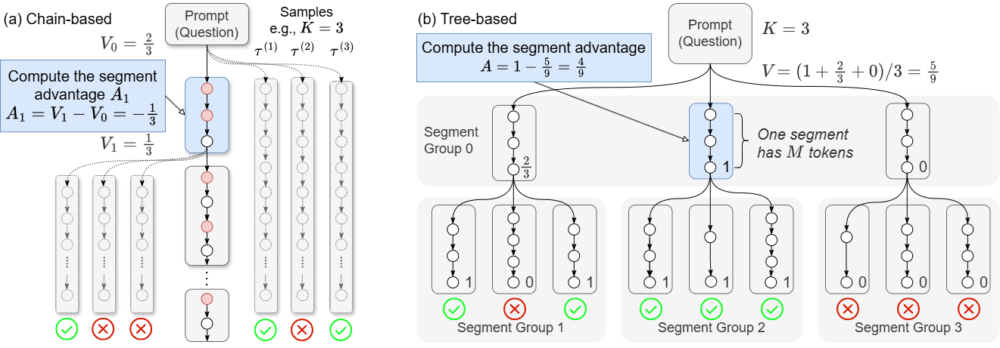
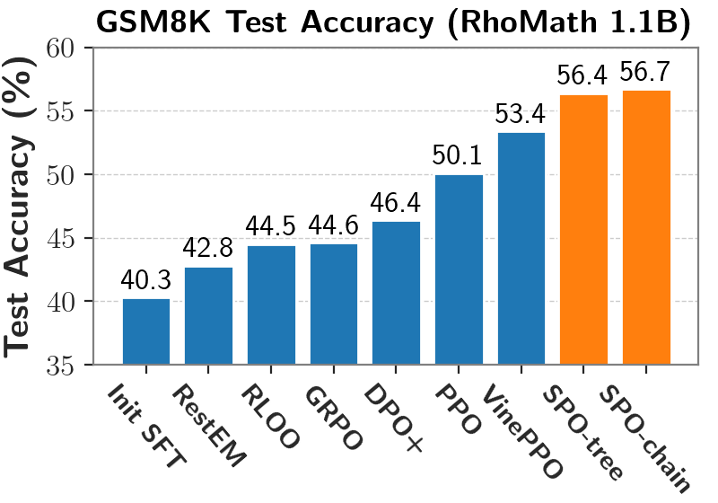
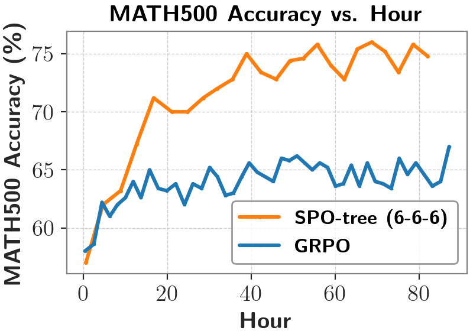

<div align="center">

# Segment Policy Optimization (SPO)

<div>
🚀 Segment Policy Optimization: Improved Credit Assignment in Reinforcement Learning for LLMs 🌟
</div>
</div>
<div>
<br>

<div align="center">

[](https://arxiv.org/abs/2505.23564)
[](https://github.com/AIFrameResearch/SPO) 


</div>

</div>


## Overview

Effective credit assignment is crucial for training LLMs in reasoning tasks. Trajectory-level methods such as GRPO rely solely on sparse final rewards, making credit assignment challenging. Token-level methods like PPO heavily depend on the critic model, whose value estimation is often inaccurate. The SPO framework aims to balance these extremes by operating at the segment granularity, providing several key advantages:

- **Improved credit assignment:** Segment-level feedback provides more localized information than trajectory-level methods, allowing credit assignment to shorter segments. This finer granularity enables the model to reward partial progress even for ultimately unsuccessful responses and penalize redundancy or unnecessary portions within successful responses. 
- **More accurate advantage estimation:** Compared to token-level advantages, segment-level advantages involve fewer estimation points. This enables SPO to leverage effective Monte Carlo (MC) sampling, yielding accurate and unbiased advantage estimation directly from the policy, thus eliminating the need for an additional, unstable critic model. 
- **Flexibility and adaptability:** Our segment partition method can be arbitrarily defined without requiring semantic completeness, offering flexible adjustment of granularity from token-level to trajectory-level, making it adaptable to a wide range of tasks.

Our framework consists of three components: ***Segment Partition***, ***Segment Advantage Estimation***, and ***Policy Optimization Using Segment Advantages***. Each component can be implemented in various ways, allowing tailored adaptations for different scenarios.


## Instances

**SPO-chain**: A tailored instance of SPO for short CoT scenarios, featuring probability-guided segment partition, chain-based segment advantage estimation, and policy optimization via policy gradient with probability masks.

**SPO-tree**: A specially designed instance of SPO for long CoT scenarios, featuring a novel tree-based segment advantage estimation method. This approach significantly reduces sampling overhead, enabling the effective application of our framework in long CoT settings.



## Getting Started 🎯

1. Clone the repository

   ```sh
   git clone https://github.com/AIFrameResearch/SPO
   ```

2. Create a conda environment

   ```sh
   conda create -n spo python=3.10
   conda activate spo
   ```

3. Install dependencies

   ```sh
   cd SPO
   pip install -r requirements.txt
   ```

4. Download the dataset

   ```sh
   bash scripts/download_and_prepare_dataset.sh
   ```

## Train 🤖

### Rho-1.1B on GSM8K

**SPO-chain (int5):**

```sh
export MASTER_PORT=$(python -c "import socket; s=socket.socket(socket.AF_INET, socket.SOCK_STREAM); s.bind(('', 0)); print(s.getsockname()[1]); s.close()")
export APP_SEED="42"

WANDB_PROJECT=spo-gsm8k APP_EXPERIMENT_NAME=rho1.1b-spo-chain-int5 APP_DIRECTORY=SPO-experiments APP_MINIMIZE_STORED_FILES=True deepspeed --master_port $MASTER_PORT --include localhost:0  src/treetune/main.py --configs "configs/polIter_rho1bSft2_spo_chain_GSM8K.jsonnet,configs/episode_generators/interval5.jsonnet,configs/gpus/gpu_0.jsonnet" run_iteration_loop
```

You can switch to different segment intervals by specifying alternative configuration files, for example:

```sh
WANDB_PROJECT=spo-gsm8k APP_EXPERIMENT_NAME=rho1.1b-spo-chain-int10 APP_DIRECTORY=SPO-experiments APP_MINIMIZE_STORED_FILES=True deepspeed --master_port $MASTER_PORT --include localhost:0  src/treetune/main.py --configs "configs/polIter_rho1bSft2_spo_chain_GSM8K.jsonnet,configs/episode_generators/interval10.jsonnet,configs/gpus/gpu_0.jsonnet" run_iteration_loop
```

**SPO-tree (6-6-6):**

```sh
export MASTER_PORT=$(python -c "import socket; s=socket.socket(socket.AF_INET, socket.SOCK_STREAM); s.bind(('', 0)); print(s.getsockname()[1]); s.close()")
export APP_SEED="42"

WANDB_PROJECT=spo-gsm8k APP_EXPERIMENT_NAME=rho1.1b-spo-tree-666 APP_DIRECTORY=SPO-experiments APP_MINIMIZE_STORED_FILES=True deepspeed --master_port $MASTER_PORT --include localhost:0  src/treetune/main.py --configs "configs/polIter_rho1bSft2_spo_tree_GSM8K.jsonnet,configs/gpus/gpu_0.jsonnet" run_iteration_loop
```

You can switch to different tree structures by specifying alternative configuration files, for example:

```sh
WANDB_PROJECT=spo-gsm8k APP_EXPERIMENT_NAME=rho1.1b-spo-tree-456 APP_DIRECTORY=SPO-experiments APP_MINIMIZE_STORED_FILES=True deepspeed --master_port $MASTER_PORT --include localhost:0  src/treetune/main.py --configs "configs/polIter_rho1bSft2_spo_tree_GSM8K.jsonnet,configs/episode_generators/branch_factor_456.jsonnet,configs/gpus/gpu_0.jsonnet" run_iteration_loop
```

### DeepSeek-R1-Distill-Qwen-1.5B on MATH

**GRPO:**

```sh
export MASTER_PORT=$(python -c "import socket; s=socket.socket(socket.AF_INET, socket.SOCK_STREAM); s.bind(('', 0)); print(s.getsockname()[1]); s.close()")
export APP_SEED="42"

WANDB_PROJECT=spo-math APP_EXPERIMENT_NAME=qwen1.5b-grpo APP_DIRECTORY=SPO-experiments APP_MINIMIZE_STORED_FILES=True deepspeed --master_port $MASTER_PORT --include localhost:0  src/treetune/main.py --configs "configs/polIter_qwen1b_grpo_MATH.jsonnet,configs/gpus/gpu_0.jsonnet" run_iteration_loop
```

**SPO-tree (6-6-6)**

```sh
export MASTER_PORT=$(python -c "import socket; s=socket.socket(socket.AF_INET, socket.SOCK_STREAM); s.bind(('', 0)); print(s.getsockname()[1]); s.close()")
export APP_SEED="42"

WANDB_PROJECT=spo-math APP_EXPERIMENT_NAME=qwen1.5b-spo-tree-666 APP_DIRECTORY=SPO-experiments APP_MINIMIZE_STORED_FILES=True deepspeed --master_port $MASTER_PORT --include localhost:0  src/treetune/main.py --configs "configs/polIter_qwen1b_spo_tree_MATH.jsonnet,configs/gpus/gpu_0.jsonnet" run_iteration_loop
```

## Evaluation ⚖️

All the details of our experiments—including training curves, evaluation metrics, and more—are fully recorded and available at https://wandb.ai/my-wandb-team/SPO-experiments. You can use filter to view different groups of experiments. Feel free to check them out!

We also provide our model weight on huggingface, you can simply to get the result in our paper following steps below.

### Short CoT scenario

We use `realtreetune/rho-1b-sft-GSM8K` as base model and finetune it using `GSM8K` train dataset.

You can use the following command to get the test accuracy of our model. 

```sh
export MASTER_PORT=$(python -c "import socket; s=socket.socket(socket.AF_INET, socket.SOCK_STREAM); s.bind(('', 0)); print(s.getsockname()[1]); s.close()")

# SPO-chain-int5
WANDB_PROJECT=spo-gsm8k APP_EXPERIMENT_NAME=evaluation-rho1.1b-chain-int5 APP_DIRECTORY=SPO-experiments APP_MINIMIZE_STORED_FILES=True deepspeed --master_port $MASTER_PORT --include localhost:0 src/treetune/main.py --configs "configs/polIter_rho1bSft2_spo_chain_GSM8K.jsonnet,configs/gpus/gpu_0.jsonnet" evaluate --iteration 0 --last_policy_path gyr66/spo-chain-int5-rho1.1B-gsm8k

# SPO-tree-666
WANDB_PROJECT=spo-gsm8k APP_EXPERIMENT_NAME=evaluation-rho1.1b-spo-tree-666 APP_DIRECTORY=SPO-experiments APP_MINIMIZE_STORED_FILES=True deepspeed --master_port $MASTER_PORT --include localhost:0 src/treetune/main.py --configs "configs/polIter_rho1bSft2_spo_tree_GSM8K.jsonnet,configs/gpus/gpu_0.jsonnet" evaluate --iteration 0 --last_policy_path gyr66/spo-tree-666-rho1.1B-gsm8k
```

<div align="center">
  

  <sub>*SPO-chain achieves the highest accuracy on the GSM8K test set, outperforming PPO and GRPO by 6-12 percentage points.*</sub>
</div>

### Long CoT scenario

We use `deepseek-ai/DeepSeek-R1-Distill-Qwen-1.5B` as base model and finetune it using `MATH` train dataset. We evaluate different baselines using evaluation script from https://github.com/huggingface/open-r1. Note that DeepScaleR and STILL-3 employ substantially larger training datasets and longer context lengths (DeepScaleR increases context lengths progressively from 8K to 16K and finally to 24K, whereas our model starts at 2K and scales up to only 4K). Due to constraints on computational resources—we train our model using just a single A100 GPU (80GB)—we did not extend our experiments to longer context scenarios. You can use `scripts/evaluate_long_cot.sh` to evaluate our released checkpoint.

<div align="center">
  

  <sub>*Compared to GRPO, SPO-tree achieves more efficient training and achieves higher accuracy.*</sub>
</div>

<div align="center">
<b>Table: Accuracy comparison on MATH500 and AIME24 datasets</b>

| Context Size | Dataset | Base  | GRPO  | SPO-tree  | DeepScaleR | STILL-3 |
| ------------ | ------- | ----- | ----- | --------- | ---------- | ------- |
| 2K           | MATH500 | 0.566 | 0.62  | **0.736** | 0.538      | 0.662   |
| 4K           | MATH500 | 0.740 | 0.752 | **0.828** | 0.744      | 0.794   |
| 32K          | MATH500 | 0.838 | 0.84  | 0.848     | **0.878**  | 0.846   |
| 2K           | AIME24 | 0.067 | 0.033  | **0.1** | 0      | 0.067   |
| 4K           | AIME24 | 0.167 | **0.2** | **0.2** | 0.167      | 0.133   |
| 32K          | AIME24 | 0.267 | **0.333**  | **0.333**     | **0.333**  | 0.233   |

</div>

## **Acknowledgment**

Our code implementation is adapted from the repository provided by VinePPO (https://github.com/McGill-NLP/VinePPO). We sincerely thank the authors for making their code publicly available.