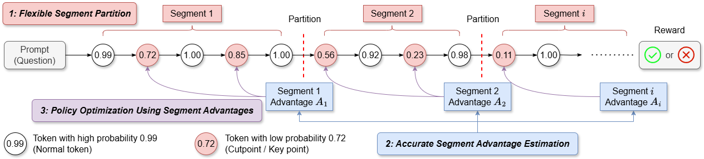
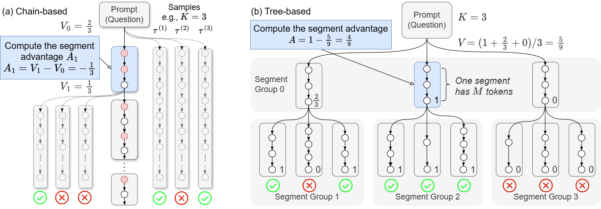
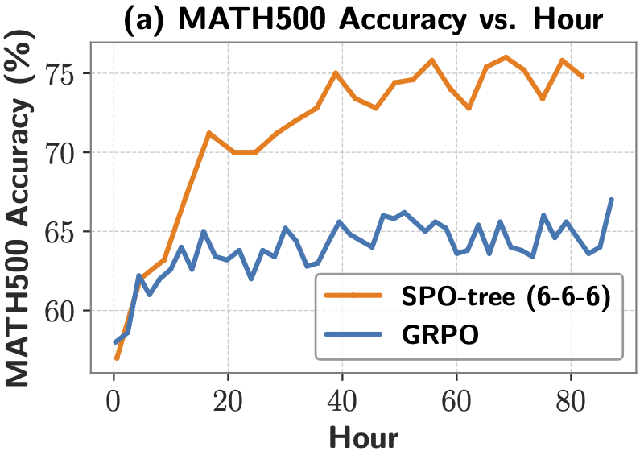
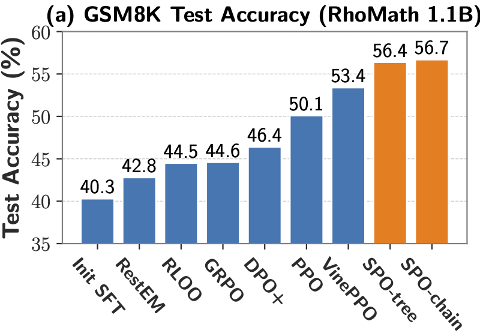

# Segment Policy Optimization: Improved Credit Assignment in Reinforcement Learning for LLMs

Effective credit assignment is crucial for training LLMs in reasoning tasks. Trajectory-level methods such as GRPO rely solely on sparse final rewards, making credit assignment challenging. Token-level methods like PPO heavily depend on the critic model, whose value estimation is often inaccurate. The SPO framework aims to balance these extremes by operating at the segment granularity, enabling richer feedback signals compared to GRPO and allowing more accurate Monte Carlo estimates of segment-level advantages, thereby bypassing the need for a critic model.



We propose two segment advantage methods. The first is a straightforward, chain-based method, suitable for the shot-CoT scenario where the computational cost of MC sampling is manageable. The second is a novel tree-based approach, which organizes the trajectory sampling procedure into a tree structure. By employing a fixed token-count segment partition strategy, we ensure trajectories within each segment group share the same prompt and token count, enabling estimation of segment advantages within these groups.



## Prepare

1. Clone the repository

   ```sh
   git clone https://github.com/AIFrameResearch/SPO
   ```

2. Create a conda environment

   ```sh
   conda create -n spo python=3.10
   conda activate spo
   ```

3. Install dependencies

   ```sh
   cd SPO
   pip install -r requirements.txt
   ```

4. Download the dataset

   ```sh
   bash scripts/download_and_prepare_dataset.sh
   ```

## Train

### Rho-1.1B on GSM8K

**SPO-chain (int5):**

```sh
export MASTER_PORT=$(python -c "import socket; s=socket.socket(socket.AF_INET, socket.SOCK_STREAM); s.bind(('', 0)); print(s.getsockname()[1]); s.close()")
export APP_SEED="42"

WANDB_PROJECT=spo-gsm8k APP_EXPERIMENT_NAME=rho1.1b-spo-chain-int5 APP_DIRECTORY=SPO-experiments APP_MINIMIZE_STORED_FILES=True deepspeed --master_port $MASTER_PORT --include localhost:0  src/treetune/main.py --configs "configs/polIter_rho1bSft2_spo_chain_GSM8K.jsonnet,configs/episode_generators/interval5.jsonnet,configs/gpus/gpu_0.jsonnet" run_iteration_loop
```

You can switch to different segment intervals by specifying alternative configuration files, for example:

```sh
WANDB_PROJECT=spo-gsm8k APP_EXPERIMENT_NAME=rho1.1b-spo-chain-int10 APP_DIRECTORY=SPO-experiments APP_MINIMIZE_STORED_FILES=True deepspeed --master_port $MASTER_PORT --include localhost:0  src/treetune/main.py --configs "configs/polIter_rho1bSft2_spo_chain_GSM8K.jsonnet,configs/episode_generators/interval10.jsonnet,configs/gpus/gpu_0.jsonnet" run_iteration_loop
```

**SPO-tree (6-6-6):**

```sh
export MASTER_PORT=$(python -c "import socket; s=socket.socket(socket.AF_INET, socket.SOCK_STREAM); s.bind(('', 0)); print(s.getsockname()[1]); s.close()")
export APP_SEED="42"

WANDB_PROJECT=spo-gsm8k APP_EXPERIMENT_NAME=rho1.1b-spo-tree-666 APP_DIRECTORY=SPO-experiments APP_MINIMIZE_STORED_FILES=True deepspeed --master_port $MASTER_PORT --include localhost:0  src/treetune/main.py --configs "configs/polIter_rho1bSft2_spo_tree_GSM8K.jsonnet,configs/gpus/gpu_0.jsonnet" run_iteration_loop
```

You can switch to different tree structures by specifying alternative configuration files, for example:

```sh
WANDB_PROJECT=spo-gsm8k APP_EXPERIMENT_NAME=rho1.1b-spo-tree-456 APP_DIRECTORY=SPO-experiments APP_MINIMIZE_STORED_FILES=True deepspeed --master_port $MASTER_PORT --include localhost:0  src/treetune/main.py --configs "configs/polIter_rho1bSft2_spo_tree_GSM8K.jsonnet,configs/episode_generators/branch_factor_456.jsonnet,configs/gpus/gpu_0.jsonnet" run_iteration_loop
```

### DeepSeek-R1-Distill-Qwen-1.5B on MATH

**GRPO:**

```sh
export MASTER_PORT=$(python -c "import socket; s=socket.socket(socket.AF_INET, socket.SOCK_STREAM); s.bind(('', 0)); print(s.getsockname()[1]); s.close()")
export APP_SEED="42"

WANDB_PROJECT=spo-math APP_EXPERIMENT_NAME=qwen1.5b-grpo APP_DIRECTORY=SPO-experiments APP_MINIMIZE_STORED_FILES=True deepspeed --master_port $MASTER_PORT --include localhost:0  src/treetune/main.py --configs "configs/polIter_qwen1b_grpo_MATH.jsonnet,configs/gpus/gpu_0.jsonnet" run_iteration_loop
```

**SPO-tree (6-6-6)**

```sh
export MASTER_PORT=$(python -c "import socket; s=socket.socket(socket.AF_INET, socket.SOCK_STREAM); s.bind(('', 0)); print(s.getsockname()[1]); s.close()")
export APP_SEED="42"

WANDB_PROJECT=spo-math APP_EXPERIMENT_NAME=qwen1.5b-spo-tree-666 APP_DIRECTORY=SPO-experiments APP_MINIMIZE_STORED_FILES=True deepspeed --master_port $MASTER_PORT --include localhost:0  src/treetune/main.py --configs "configs/polIter_qwen1b_spo_tree_MATH.jsonnet,configs/gpus/gpu_0.jsonnet" run_iteration_loop
```

## Evaluate

All the details of our experiments—including training curves, evaluation metrics, and more—are fully recorded and available at https://wandb.ai/my-wandb-team/SPO-experiments. You can use filter to view different groups of experiments. Feel free to check them out!

We also provide our model weight on huggingface, you can simply to get the result in our paper following steps below.

### Long CoT scenario

We use `deepseek-ai/DeepSeek-R1-Distill-Qwen-1.5B` as base model and finetune it using `MATH` train dataset. We evaluate different baselines using evaluation script from https://github.com/huggingface/open-r1. Note that DeepScaleR and STILL-3 employ substantially larger training datasets and longer context lengths (DeepScaleR increases context lengths progressively from 8K to 16K and finally to 24K, whereas our model starts at 2K and scales up to only 4K). Due to constraints on computational resources—we train our model using just a single A100 GPU (80GB)—we did not extend our experiments to longer context scenarios.

```sh
NUM_GPUS=1

MODEL=deepseek-ai/DeepSeek-R1-Distill-Qwen-1.5B # Base model

MODEL=agentica-org/DeepScaleR-1.5B-Preview # DeepScaleR

MODEL=RUC-AIBOX/STILL-3-1.5B-preview # STILL-3

MODEL=gyr66/spo-tree-666-qwen1.5B-math # Model trained using SPO-tree (2K->4K)

MODEL=gyr66/grpo-qwen1.5B-math # Model trained using GRPO (2K->4K)

OUTPUT_DIR=data/evals/$MODEL

MODEL_ARGS="pretrained=$MODEL,dtype=bfloat16,max_model_length=2048,gpu_memory_utilization=0.8,data_parallel_size=$NUM_GPUS,generation_parameters={max_new_tokens:2048,temperature:0.6,top_p:0.95}" # 2K context

MODEL_ARGS="pretrained=$MODEL,dtype=bfloat16,max_model_length=4096,gpu_memory_utilization=0.8,data_parallel_size=$NUM_GPUS,generation_parameters={max_new_tokens:4096,temperature:0.6,top_p:0.95}" # 4K context

MODEL_ARGS="pretrained=$MODEL,dtype=bfloat16,max_model_length=32768,gpu_memory_utilization=0.8,data_parallel_size=$NUM_GPUS,generation_parameters={max_new_tokens:32768,temperature:0.6,top_p:0.95}" # 32K context

lighteval vllm $MODEL_ARGS "custom|math_500|0|0" \
    --use-chat-template \
    --output-dir $OUTPUT_DIR
```



**Table: Accuracy (%) comparison on MATH500 and AIME datasets**

| Context Size | Dataset | Base  | GRPO  | SPO-tree  | DeepScaleR | STILL-3 |
| ------------ | ------- | ----- | ----- | --------- | ---------- | ------- |
| 2K           | MATH500 | 0.566 | 0.62  | **0.736** | 0.538      | 0.662   |
| 4K           | MATH500 | 0.740 | 0.752 | **0.828** | 0.744      | 0.794   |
| 32K          | MATH500 | 0.838 | 0.84  | 0.848     | **0.878**  | 0.846   |

### Short CoT scenario

We use `realtreetune/rho-1b-sft-GSM8K` as base model and finetune it using `GSM8K` train dataset.

You can use the following command to get the test accuracy of our model. 

```sh
export MASTER_PORT=$(python -c "import socket; s=socket.socket(socket.AF_INET, socket.SOCK_STREAM); s.bind(('', 0)); print(s.getsockname()[1]); s.close()")

# SPO-chain-int5
WANDB_PROJECT=spo-gsm8k APP_EXPERIMENT_NAME=evaluation-rho1.1b-chain-int5 APP_DIRECTORY=SPO-experiments APP_MINIMIZE_STORED_FILES=True deepspeed --master_port $MASTER_PORT --include localhost:0 src/treetune/main.py --configs "configs/polIter_rho1bSft2_spo_chain_GSM8K.jsonnet,configs/gpus/gpu_0.jsonnet" evaluate --iteration 0 --last_policy_path gyr66/spo-chain-int5-rho1.1B-gsm8k

# SPO-tree-666
WANDB_PROJECT=spo-gsm8k APP_EXPERIMENT_NAME=evaluation-rho1.1b-spo-tree-666 APP_DIRECTORY=SPO-experiments APP_MINIMIZE_STORED_FILES=True deepspeed --master_port $MASTER_PORT --include localhost:0 src/treetune/main.py --configs "configs/polIter_rho1bSft2_spo_tree_GSM8K.jsonnet,configs/gpus/gpu_0.jsonnet" evaluate --iteration 0 --last_policy_path gyr66/spo-tree-666-rho1.1B-gsm8k
```



The baseline performance is from https://arxiv.org/abs/2410.01679. 

## **Acknowledgments**

Our code implementation is adapted from the repository provided by VinePPO (https://github.com/McGill-NLP/VinePPO). We sincerely thank the authors for making their code publicly available.